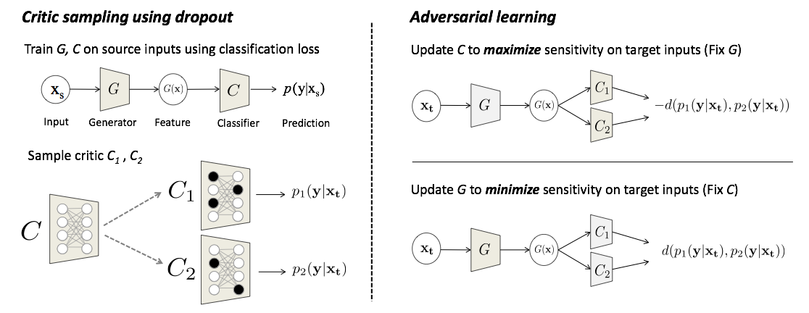

# Adversarial Dropout Regularization

## Abstract
We present a domain adaptation method for transferring neural representations from label-rich source domains to unlabeled target domains. Recent adversarial methods proposed for this task learn to align features across domains by ``fooling'' a special domain classifier network. However, a drawback of this approach is that the domain classifier simply labels the generated features as in-domain or not, without considering the boundaries between classes. This means that ambiguous target features can be generated near class boundaries, reducing target classification accuracy. We propose a novel approach, Adversarial Dropout Regularization (ADR), which encourages the generator to output more discriminative features for the target domain. Our key idea is to replace the traditional domain critic with a critic that detects non-discriminative features by using dropout on the classifier network. The generator then learns to avoid these areas of the feature space and thus creates better features. We apply our ADR approach to the problem of unsupervised domain adaptation for image classification and semantic segmentation tasks, and demonstrate significant improvements over the state of the art.

The work was accepted by ICLR 2018.
[[PDF]](https://openreview.net/forum?id=HJIoJWZCZ).

## Overview


## Code
https://github.com/mil-tokyo/adr_da
## Citation
If you use our code for your research, please cite our papers.
```
@article{saito2017adversarial,
  title={Adversarial Dropout Regularization},
  author={Saito, Kuniaki and Ushiku, Yoshitaka and Harada, Tatsuya and Saenko, Kate},
  journal={arXiv preprint arXiv:1711.01575},
  year={2017}
}

```
